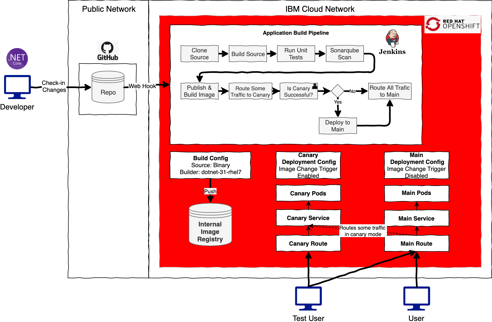

# OpenShift Advanced Deployments

## Canary Release with OpenShift Demo Flow

OpenShift templates and Space Game ASP.Net Core application were prepared to demonstrate Canary Release flow with OpenShift v4.3 and Jenkins pipelines. 

Canary Release deploys new version of the application to production side by side old version, and routes some traffic (e.g. 10%) to the new one to test it with real users, if the new version works well, then release manager gives approval to make the new version as production version and remove the old version.

CI/CD flow is depicted in the following diagram.

This flow was presented in an IBM Event in 2020. 

Here is the [web based presentation](./jtc-summit/index.html) prepared with impress.js. 